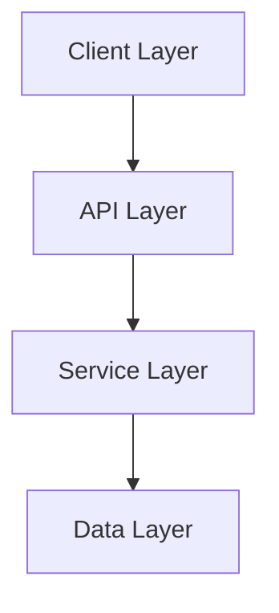
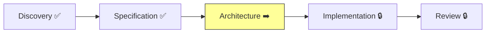

# Feature Design: Visual CLI Enhancement

| Field    | Value                         |
|----------|-------------------------------|
| Project  | harnesskit-dev                  |
| Date     | 2026-02-25                    |
| Version  | 4.0                           |
| Agent    | leonard                       |
| Phase    | Architecture (New Features)   |
| Cycle    | 4                             |

---

## Executive Summary

Design para melhoria visual completa do Harnesskit em ambiente CLI com Markdown rendering. A abordagem é **enriquecimento incremental** — não altera estrutura existente, apenas adiciona padrões visuais. O eixo central é um **Visual Style Guide** (`core/style-guide.md`) que define todos os padrões e é referenciado pelos agentes. As mudanças são puramente aditivas em 3 camadas: (1) style guide como referência, (2) agent persona.style enriquecido, (3) templates e instructions com callouts/progress/Mermaid.

---

## Existing Architecture Overview

O Harnesskit formata output via 3 mecanismos:

1. **`persona.style`** (agent YAML) — Define como cada agente se expressa (3-6 linhas de texto descritivo)
2. **`instructions.md`** (workflows) — Define como o agente executa e formata cada passo
3. **`template.md`** (workflows) — Define a estrutura dos artefatos produzidos

**Formatação atual:**
- Emojis de identidade (🧠🎯🏗️🔧🔬🔎🎨) — consistente
- Status indicators (✅➡️🔒⬜) — consistente, só no Sheldon
- Tabelas Markdown — extensivo em templates
- Headers H2/H3/H4 — consistente
- Blockquotes — uso mínimo, sem padrão
- Nenhum progress bar, callout padronizado, ou Mermaid

**Princípio arquitetural:** O Harnesskit não tem runtime — toda formatação é declarativa. Agentes "leem" as instruções e formatam output de acordo. Portanto, melhorar a formatação = melhorar as instruções de formatação.

---

## Feature Designs

### Design 1: Visual Style Guide (US-001)

#### Current State

Não existe documento centralizado de padrões visuais. Cada agente tem `persona.style` independente. Consistência existe por padrão implícito, não por referência explícita.

#### Proposed Changes

Nenhum arquivo existente modificado.

#### New Components

- `core/style-guide.md` — Documento de ~180 linhas com 6 seções:

**Estrutura proposta:**

```markdown
# Harnesskit Visual Style Guide

## 1. Callouts & Admonitions
- 6 tipos com emoji + bold label + texto
- Regras de uso (máximo 3-4 por arquivo)
- Anti-patterns (não usar para decoração)

## 2. Progress Bars
- Formato: ████████░░ 80% (4/5 phases)
- Largura fixa: 10 chars
- Sempre com percentual e contagem
- Fórmula: Math.round(completed/total * 10) blocos █

## 3. Mermaid Diagrams
- Flowchart: componentes e conexões
- Sequence: handoff chains e data flow
- Regra: sempre com fallback texto
- Máximo 10-15 nós

## 4. Emphasis Patterns
- **Bold**: termos-chave, labels, nomes
- *Italic*: primeira menção de termos técnicos
- `Code`: paths, filenames, comandos, IDs
- ~~Strikethrough~~: deprecated

## 5. Structural Conventions
- H2 para seções, H3 para subseções, H4 para items
- --- entre seções principais
- Metadata table no topo de artefatos

## 6. Anti-Patterns
- Emojis em excesso (máx 1-2 por header)
- Tabelas onde listas bastam
- Callouts decorativos (sem informação útil)
- Formatação inconsistente entre seções
- Headers sem conteúdo abaixo
```

#### Trade-offs

| Option | Pros | Cons | Chosen? |
|--------|------|------|---------|
| Style guide em `core/style-guide.md` | Centralizado, versionado, referenciável | 1 arquivo extra | **Sim** |
| Inline em cada agent.yaml | Sem arquivo extra | Duplicação, inconsistência | Não |
| Seção em `harnesskit.yaml` | Junto com config | YAML não é bom para exemplos visuais | Não |

---

### Design 2: Agent Output Enhancement (US-008, US-009, US-010)

#### Current State

Cada agente tem `persona.style` com 3-6 linhas descritivas. Funcionam como guia de tom/voz. Nenhum referencia padrões visuais específicos.

#### Proposed Changes

Adicionar ~4-6 linhas à `persona.style` de cada agente, sem alterar o texto existente:

**Sheldon** (orchestrator):
```yaml
style: >
  [texto existente mantido integralmente]

  Formatting: Follows patterns from core/style-guide.md. Uses progress
  bars (████░░ format) for project and phase status. Uses callout
  📋 Important when citing Constitution principles. Optionally includes
  Mermaid flowchart in map view.
```

**Penny** (analyst):
```yaml
style: >
  [texto existente mantido]

  Formatting: Follows core/style-guide.md. Uses 💡 Tip callouts to
  guide users in answering questions. Uses summary tables for
  requirements and feature matrices. Numbers requirements (FR-X.X).
```

**Leonard** (architect):
```yaml
style: >
  [texto existente mantido]

  Formatting: Follows core/style-guide.md. Uses Mermaid flowcharts
  for component diagrams and data flow. Uses trade-off tables with
  Pros/Cons columns. Uses ⚠️ Warning callouts for architectural risks.
```

**Howard** (developer):
```yaml
style: >
  [texto existente mantido]

  Formatting: Follows core/style-guide.md. Uses code blocks with
  language specifiers (```yaml, ```js). Uses 📋 Important callouts
  for implementation rules. Shows file paths as `inline code`.
```

**Amy** (reviewer):
```yaml
style: >
  [texto existente mantido]

  Formatting: Follows core/style-guide.md. Uses compliance bars
  (████████░░ format) in review reports. Uses severity indicators:
  🔴 Critical, 🟡 Warning, 🟢 Info. Uses ❌ Error callouts for
  issues found.
```

**Raj** (analyst):
```yaml
style: >
  [texto existente mantido]

  Formatting: Follows core/style-guide.md. Uses impact matrices in
  tables. Uses ⚠️ Warning callouts for high-impact areas. Uses
  📌 Note callouts for codebase observations.
```

**Emily** (designer):
```yaml
style: >
  [texto existente mantido]

  Formatting: Follows core/style-guide.md. Uses code blocks for
  design token examples (CSS variables). Uses component state tables.
  Uses 💡 Tip callouts for art direction guidance.
```

#### Trade-offs

| Option | Pros | Cons | Chosen? |
|--------|------|------|---------|
| Append formatting directives ao style existente | Preserva personalidade, aditivo | Style section fica mais longo | **Sim** |
| Seção separada `formatting:` no YAML | Separação clara | Muda schema, mais complexo | Não |
| Inline nos instructions.md apenas | Não toca agent YAML | Agente "esquece" formatting fora do workflow | Não |

---

### Design 3: Callout Application (US-002, US-003, US-004, US-005, US-015)

#### Current State

~16 instructions.md e ~16 template.md existentes. Alguns usam `>` blockquotes mas sem padrão. Callouts como `> IMPORTANT:` existem esporadicamente.

#### Proposed Changes

Modificar ~35-40 arquivos existentes (instructions + templates). Mudanças são **puramente aditivas** — conteúdo existente não é alterado, apenas formatado.

**Padrão de aplicação nos instructions.md:**

1. **Regras críticas** → `> 📋 **Important:** [regra]`
   - Language protocol ("responda no idioma configurado")
   - Constitution principles citados
   - Handoff requirements

2. **Riscos/cuidados** → `> ⚠️ **Warning:** [risco]`
   - "Não pular esta verificação"
   - "Verificar state.json antes de agir"

3. **Sugestões** → `> 💡 **Tip:** [sugestão]`
   - "Pergunte ao usuário se está claro"
   - "Leia os artifacts anteriores primeiro"

**Padrão de aplicação nos template.md:**

1. **Notas contextuais** → `> 📌 **Note:** [contexto]`
   - "Seção preenchida automaticamente"
   - "Valores de placeholder — substituir"

2. **Orientação** → `> 💡 **Tip:** [orientação]`
   - "Use dados concretos, não estimativas"

**Regra de moderação:** Máximo 3-4 callouts por instructions.md, máximo 2-3 por template.md.

#### Trade-offs

| Option | Pros | Cons | Chosen? |
|--------|------|------|---------|
| Callouts como blockquotes com emoji | Renderiza em todo Markdown, visualmente claro | Depende de emoji rendering | **Sim** |
| Callouts como HTML `<div class="warning">` | Mais controle visual | Não renderiza em CLI/Markdown puro | Não |
| GitHub-style `> [!WARNING]` | Padrão GitHub | Não suportado em todos os renderers | Não |

---

### Design 4: Progress Visualization (US-006, US-007)

#### Current State

Sheldon mostra status com emojis (✅➡️🔒). Amy mostra resultados em tabelas. Nenhum usa progress bar.

#### Proposed Changes

**Sheldon** — `sheldon.agent.yaml`, seção `activation` > "Present visual status":

Adicionar progress bar ao layout de status:
```
## 🧠 Sheldon — Project Status

**Project**: [name]
**Progress**: ██████░░░░ 60% (3/5 phases)

### Phase Map
[mapa existente com ✅➡️🔒 mantido]

### Current Phase
**Specification**: ████████░░ 80% (4/5 steps)
```

**Amy** — `5-review/template.md`:

Adicionar seção de compliance bar:
```
## Compliance Summary

████████░░ 85% (12/14 items passed)

🔴 Critical: 0 | 🟡 Warning: 2 | 🟢 Passed: 12
```

#### Trade-offs

| Option | Pros | Cons | Chosen? |
|--------|------|------|---------|
| Unicode blocks █░ | Suportado universalmente, alinhamento consistente | Limitado a 10 "pixels" de resolução | **Sim** |
| ASCII `[====    ]` | Mais compatível | Menos visual, parece antigo | Não |
| Percentual apenas | Simples | Não visual | Não |

---

### Design 5: Mermaid Diagrams (US-011, US-012, US-013, US-014)

#### Current State

Template de architecture tem placeholder ASCII art para component diagram. Nenhum template usa Mermaid. Leonard menciona "uses diagrams" no style mas sem especificar formato.

#### Proposed Changes

**Templates de architecture** — Substituir ASCII placeholder por Mermaid + fallback:

```markdown
## Component Diagram

{{#if component_diagram}}
{{component_diagram}}
{{else}}

**Components and their connections:**

[Texto descritivo do diagrama — fallback quando Mermaid não renderiza]



_Replace with actual component diagram for the project._
{{/if}}
```

**Leonard instructions** — Adicionar orientação sobre Mermaid:
- Quando usar: component diagrams, data flow
- Formato preferido: flowchart TD para componentes, sequenceDiagram para data flow
- Regra: sempre com fallback texto antes

**Sheldon** (opcional, US-014) — Mermaid pipeline no "map" command:


#### Trade-offs

| Option | Pros | Cons | Chosen? |
|--------|------|------|---------|
| Mermaid com fallback texto | Melhor de dois mundos | Informação duplicada | **Sim** |
| Só Mermaid | Mais limpo | Perde info se não renderiza | Não |
| Só texto/ASCII art | Universal | Menos visual | Não |

---

## Implementation Plan for Howard

| Order | Story | What to Build | Effort |
|-------|-------|---------------|--------|
| 1 | US-001 | Criar `core/style-guide.md` (~180 linhas) | M |
| 2 | US-008 | Enriquecer `persona.style` do Sheldon + progress bars na activation | S |
| 3 | US-009 | Enriquecer `persona.style` de Penny, Howard, Raj | S |
| 4 | US-010 | Enriquecer `persona.style` de Leonard, Amy, Emily | S |
| 5 | US-006 | Adicionar progress bars ao status do Sheldon (activation section) | S |
| 6 | US-007 | Adicionar compliance bar ao review template (5-review/template.md) + Amy agent | S |
| 7 | US-002 | Aplicar callouts em instructions.md greenfield (7 files) | M |
| 8 | US-003 | Aplicar callouts em instructions.md brownfield (4 files) | S |
| 9 | US-004 | Aplicar callouts em instructions.md new-features (5+ files) | S |
| 10 | US-015 | Aplicar callouts em party-mode instructions | S |
| 11 | US-005 | Aplicar callouts em template.md (todos os tracks, ~16 files) | M |
| 12 | US-013 | Adicionar Mermaid guidance ao Leonard (agent + instructions) | S |
| 13 | US-011 | Adicionar Mermaid ao template architecture greenfield | M |
| 14 | US-012 | Adicionar Mermaid aos templates brownfield + new-features | S |
| 15 | US-014 | Mermaid workflow pipeline no Sheldon (opcional) | S |

**Epics sugeridos:**
- **Epic 1 (Foundation):** US-001 — style guide
- **Epic 2 (Agent Enhancement):** US-008, US-009, US-010, US-006, US-007 — agent formatting + progress bars
- **Epic 3 (Callouts):** US-002, US-003, US-004, US-015, US-005 — callouts em instructions + templates
- **Epic 4 (Mermaid):** US-013, US-011, US-012, US-014 — diagrams

---

## Next Steps

- [x] Design reviewed and approved by the user
- [ ] Handoff to Howard (implementation)
- [ ] State.json updated
