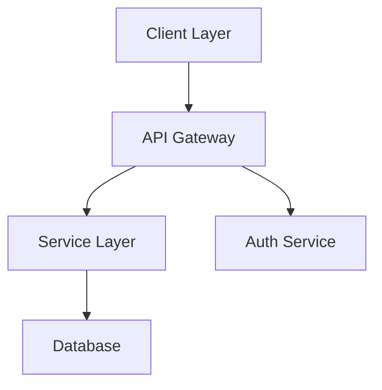
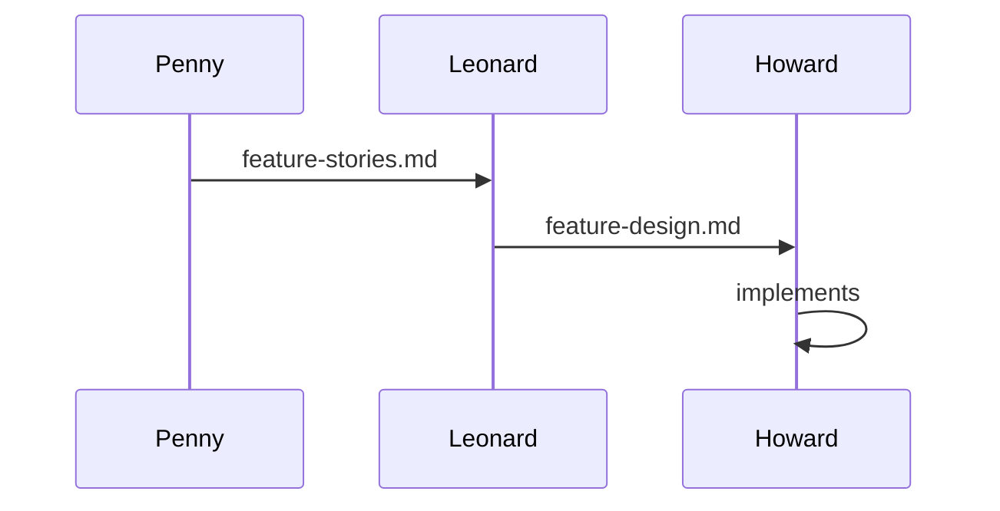
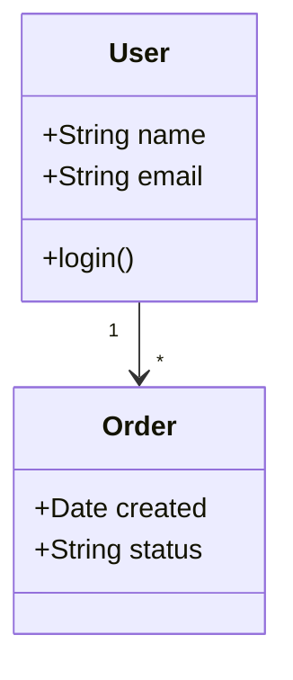

# Harnesskit Visual Style Guide

Reference for all agents and templates. Defines formatting patterns for
consistent, rich CLI output in Markdown-rendering terminals (Claude Code).

---

## 1. Callouts & Admonitions

Use blockquotes with emoji + bold label. Place at critical decision points,
not as decoration.

| Type | Format | When to Use |
|------|--------|-------------|
| Important | `> 📋 **Important:**` | Rules the agent MUST follow, Constitution principles |
| Warning | `> ⚠️ **Warning:**` | Risks, breaking changes, irreversible actions |
| Tip | `> 💡 **Tip:**` | Suggestions, best practices, shortcuts |
| Note | `> 📌 **Note:**` | Contextual information, clarifications |
| Success | `> ✅ **Success:**` | Confirmations, positive outcomes |
| Error | `> ❌ **Error:**` | Failures, problems found, blockers |

**Examples:**

> 📋 **Important:** All responses must be in the language configured in
> `harnesskit.yaml > user_preferences.response_language`.

> ⚠️ **Warning:** Skipping this verification may result in inconsistent
> artifacts downstream.

> 💡 **Tip:** Read the previous agent's artifact before starting — it
> contains context that saves time.

**Rules:**
- Maximum 3-4 callouts per instructions.md file
- Maximum 2-3 callouts per template.md file
- Each callout must carry actionable information — no decorative use
- Use single-line callouts when possible; multi-line for complex rules

---

## 2. Progress Bars

ASCII progress bars for project status and compliance reports.

**Format:**
```
████████░░ 80% (4/5 phases)
```

**Rules:**
- Width: always 10 characters (██████████)
- Characters: `█` (U+2588, filled) and `░` (U+2591, empty)
- Always include: percentage + count in parentheses
- Formula: `round(completed / total * 10)` filled blocks

**Examples:**
```
Project:       ██████░░░░ 60% (3/5 phases)
Current Phase: ████████░░ 80% (4/5 steps)
Compliance:    ██████████ 100% (14/14 passed)
```

**When to use:**
- Sheldon: project status and phase progress
- Amy: compliance summary in review reports
- NOT in other agents (progress tracking is Sheldon's domain)

---

## 3. Mermaid Diagrams

Use Mermaid for visual diagrams in architecture and workflow documentation.

**Supported types:**

### Flowchart (components & connections)


### Sequence Diagram (handoff chains & data flow)


### Class/ER Diagram (data models)


**Rules:**
- Always include a **text fallback** before or after the diagram
- Maximum 10-15 nodes per diagram for readability
- Use descriptive node labels, not abbreviations
- Diagrams are supplementary — text carries the full information
- Leonard uses flowcharts for components, sequence for data flow
- Sheldon may use flowcharts for workflow pipeline visualization

---

## 4. Emphasis Patterns

| Style | Usage | Example |
|-------|-------|---------|
| **Bold** | Key terms, agent names, phase names, labels | **Penny**, **Discovery phase** |
| *Italic* | First mention of technical terms, soft emphasis | *Atomic Design*, *brownfield* |
| `Code` | Paths, filenames, variables, commands, IDs | `state.json`, `US-001` |
| ~~Strikethrough~~ | Deprecated items, removed features | ~~old-workflow.yaml~~ |

**Rules:**
- Bold is for importance, not decoration
- Code spans for anything the user might type or reference in files
- Italic only on first mention of a term, not repeatedly
- Don't combine styles (no ***bold italic*** or **`bold code`**)

---

## 5. Structural Conventions

**Headers:**
- `# H1` — Document title only (1 per file)
- `## H2` — Major sections
- `### H3` — Subsections
- `#### H4` — Items within subsections (stories, components)

**Separators:**
- `---` between major sections (after metadata table, between H2 sections)
- No double separators (`---\n---`)

**Metadata tables:**
- Every artifact starts with a metadata table (Field | Value)
- Fields: Project, Date, Version, Agent, Phase (minimum)

**Lists:**
- Numbered lists for sequential steps
- Bullet lists for unordered items
- Checkbox lists (`- [ ]`) for validation and next steps only

---

## 6. Anti-Patterns

**DON'T:**
- Use emojis as decoration (max 1-2 per header, only when meaningful)
- Put everything in tables (use lists when items don't have multiple columns)
- Add callouts that don't carry actionable information
- Use headers without content below them
- Mix formatting styles inconsistently between sections
- Add progress bars outside of Sheldon's status and Amy's review
- Use Mermaid without text fallback
- Over-format simple content (plain text is fine for simple messages)

**DO:**
- Keep formatting consistent within each document
- Use the simplest formatting that conveys the information
- Let white space do the work — don't fill every gap with decoration
- Match formatting to the agent's persona (Amy = tables, Howard = code blocks)
