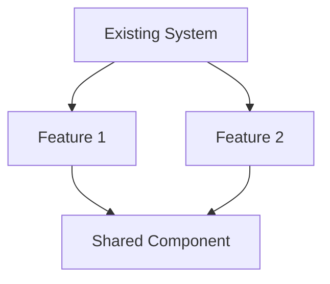

# Feature Design: {{project_name}}

| Field    | Value                         |
|----------|-------------------------------|
| Project  | {{project_name}}              |
| Date     | {{date}}                      |
| Version  | {{version}}                   |
| Agent    | leonard                       |
| Phase    | Architecture (New Features)   |

---

## Executive Summary

{{executive_summary}}

---

## Existing Architecture Overview

> 📌 **Note:** Summarized from the current codebase analysis and architecture artifacts.

{{existing_architecture}}

---

## Integration Diagram

**How new features integrate with the existing architecture:**

> 📌 **Note:** Replace this placeholder with the actual integration diagram
> showing how new features connect to existing components.

---

## Feature Designs

{{#each features}}
### {{name}}

#### Current State
{{current_state}}

#### Proposed Changes
{{#each changes}}
- `{{file}}` — {{description}}
{{/each}}

#### New Components
{{#each new_components}}
- `{{path}}` — {{description}}
{{/each}}

#### Interface Changes
{{interface_changes}}

#### Data Flow
{{data_flow}}

#### Trade-offs
| Option | Pros | Cons | Chosen? |
|--------|------|------|---------|
{{#each trade_offs}}
| {{option}} | {{pros}} | {{cons}} | {{chosen}} |
{{/each}}

#### Implementation Order
{{#each impl_order}}
{{number}}. {{description}}
{{/each}}

---
{{/each}}

## Implementation Plan for Howard

| Order | Story | What to Build | Effort |
|-------|-------|---------------|--------|
{{#each implementation_steps}}
| {{order}} | {{story_id}} | {{description}} | {{effort}} |
{{/each}}

---

## Next Steps

> 📌 **Note:** Section automatically filled by the system.

- [ ] Design reviewed and approved by the user
- [ ] Handoff created for Howard (implementation)
- [ ] State.json updated with status `completed`
